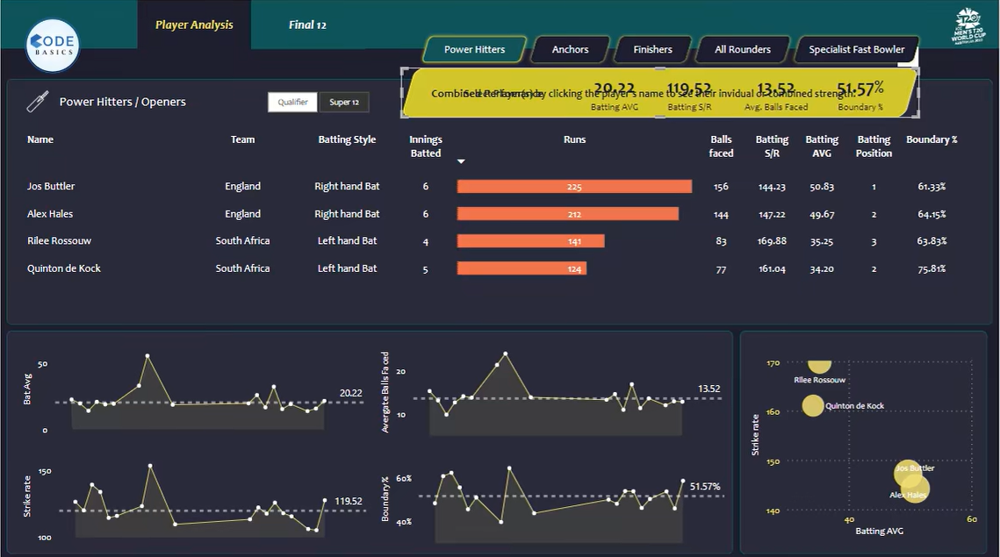

# 🏏 **Cricklytics – Cricket Data Analytics**  

Cricklytics is a **data-driven cricket analytics project** that scrapes live and historical match data from **ESPN Cricinfo**, cleans and transforms it, and builds an **interactive Power BI dashboard** to help select the **best possible playing XI** based on player performance metrics.  

This project demonstrates **end-to-end data analytics workflow** – from data collection to actionable insights.  

---

## 🚀 **Project Workflow**

### 1️⃣ Data Collection  
- **Web Scraping:** Collected player and match data from ESPN Cricinfo using **Python (BeautifulSoup, Requests)**.  
- **Raw Data Storage:** Stored scraped data as CSV files for reproducibility.  

### 2️⃣ Data Cleaning & Transformation  
- **Python Pandas:** Cleaned missing values, standardized formats, and performed feature engineering (batting/bowling averages, strike rates).  
- **Power Query:** Additional data shaping, merging, and preparation for modeling.  

### 3️⃣ Data Modeling  
- **DAX (Data Analysis Expressions):** Built calculated columns, measures, and dynamic parameters for filtering player performance.  
- **Star Schema:** Modeled relationships between players, teams, matches, and stats to support advanced filtering.  

### 4️⃣ Dashboard Creation  
- **Power BI:**  
  - Designed an interactive dashboard with KPIs (Runs, Strike Rate, Batting Average, Economy, Boundary %)  
  - Added slicers for Team, Player Role, Match Stage (Qualifier, Super 12)  
  - Used scatter plots and bar charts for visual comparison  

### 5️⃣ Insights & Final XI  
- Derived **data-driven insights** on player consistency and efficiency  
- Recommended the **best playing XI** based on performance parameters  

---

## 🛠 **Tech Stack**

- **Python** → Web scraping (BeautifulSoup, Requests), data cleaning (Pandas)  
- **Power Query** → Advanced transformation & merging  
- **DAX** → Measures, calculated columns, parameters  
- **Power BI** → Dashboard design & visualization  
- **ESPN Cricinfo** → Data source  

---

## 📊 **Sample Dashboard Preview**

Here’s a snapshot of the **Cricklytics Power BI Dashboard**:



The dashboard provides:  
✅ **Performance Comparisons** – Runs, Strike Rate, Boundary % per player  
✅ **Trend Lines** – Batting average and strike rate over time  
✅ **Scatter Plot Analysis** – Compare batting average vs strike rate  
✅ **Dynamic Role Selection** – Power Hitters, Anchors, Finishers, All-rounders  

---

## 📈 **Key Features**

- 📌 **Automated Data Pipeline** – From web scraping to dashboard visualization  
- 📌 **Dynamic Player Filtering** – Compare players based on role & stage  
- 📌 **Insightful Metrics** – Helps select the best playing XI  
- 📌 **Reusable Design** – Can be adapted for IPL, World Cup, or league analysis  

---

## 📥 **How to Run**

1. Clone this repository  
```bash
git clone https://github.com/your-username/Cricklytics.git
